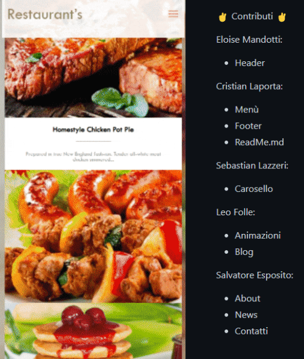

<h1 align="center"> ⭐️ Template Ristorante realizzato in HTML,CSS,JS. ⭐️ </h1>

 

 👉 Linguaggi Utilizzati nel Progetto 👈	 

    

 

  
    

 

 

 

<h1 align="center"> ️🤝 Sviluppatori 🤝 </h1>

| [Elois Mandotti](https://github.com/eloismandotti) | [Cristian Laporta](https://github.com/TheCriicom) |
|--|--|
| **[Sebastian Lazzeri](https://github.com/Ottoemmezzo)** | **[Leo Folle](https://github.com/LeoFolle)**  |
| **[Salvatore Esposito](https://github.com/Salvatore-Esposito1)** |  |

